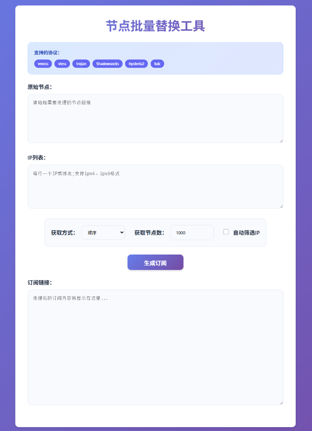

# 节点批量替换工具

一个现代化的Web工具，用于批量替换各种代理协议节点中的IP地址，支持多种协议格式和IPv4/IPv6地址。

## 页面预览



## ✨ 功能特性

### 🔧 支持的协议
- **vmess** - V2Ray的VMess协议
- **vless** - V2Ray的VLESS协议  
- **trojan** - Trojan代理协议
- **Shadowsocks** - SS协议
- **hysteria2** - Hysteria2协议
- **tuic** - TUIC协议

### 🌐 IP地址支持
- **IPv4地址** - 标准IPv4格式 (如: `1.1.1.1`)
- **IPv6地址** - 支持带中括号的IPv6格式 (如: `[2406:ef80:1:fe16::8d34:32f0]`)
- **域名** - 支持域名格式 (如: `www.example.com`)

### 🎯 核心功能
- **批量IP替换** - 将节点中的IP地址替换为指定的IP列表
- **智能IP提取** - 自动从原始节点中提取IP地址
- **多种获取方式** - 支持顺序和随机两种IP获取模式
- **灵活配置** - 可自定义生成节点数量 (1-10000)
- **实时预览** - 即时显示处理结果

## 🚀 使用方法

### 1. 输入原始节点
在"原始节点"文本框中粘贴需要处理的节点链接，支持以下格式【IPv6同理】：

```
vmess://eyJhZGQiOiIxLjEuMS4xIiwiYWlkIjoiMCIsImhvc3QiOiIiLCJpZCI6IjEyMyIsImludGVybmV0IjoiIiwiaW5ncmVzcyI6IiIsIm5ldCI6InRjcCIsIm9iZnNjdCI6IiIsInBhdGgiOiIiLCJwb3J0IjoiODA4MCIsInBzIjoiIiwidGxzIjoiIiwidHlwZSI6Im5vbmUiLCJ2IjoiMiJ9

vless://81becf5b-2391-4ded-af72-b711b6a2737b@5.10.244.53:443?encryption=none&security=tls&sni=example.com

trojan://a1b2c3d4-e5f6-7890-abcd-ef1234567890@203.32.26.81:443?security=tls&sni=www.google.com&allowInsecure=1&type=tcp&headerType=none#Trojan-Node-1

ss://YWVzLTI1Ni1nY206MTkyOGFhNGQ2ZTNjOGRmMw%3D%3D@203.32.26.81:19028

hysteria2://2429bee3-e0c1-47dd-b420-75e6512b184b@40.233.121.211:30300?sni=www.bing.com

tuic://a1b2c3d4-e5f6-7890-abcd-ef1234567890%3AuIvSBiwFio0dcNcJCrgfi1xD@203.32.26.81:443?sni=www.google.com&alpn=h3&congestion_control=bbr&udp_relay_mode=quic&allow_insecure=1#TUIC-Node-1
```

### 2. 配置IP列表
在"IP列表"文本框中输入替换用的IP地址，每行一个：

```
1.1.1.1
8.8.8.8
[2406:ef80:1:fe16::8d34:32f0]
www.google.com
```

### 3. 设置参数
- **获取方式**: 选择"顺序"或"随机"获取IP
- **获取节点数**: 设置要生成的节点数量 (默认1000)
- **自动筛选IP**: 勾选后自动从原始节点中提取IP地址

### 4. 生成订阅
点击"生成订阅"按钮，工具将：
1. 解析原始节点链接
2. 提取IP地址信息
3. 使用指定的IP列表进行替换
4. 生成新的节点链接

## 🎨 界面特性

### 现代化设计
- **渐变背景** - 美观的渐变色彩搭配
- **卡片式布局** - 清晰的信息层次结构
- **响应式设计** - 完美适配桌面和移动设备
- **动画效果** - 流畅的交互动画

### 用户体验
- **直观图标** - 每个功能区域都有对应的图标
- **实时反馈** - 操作状态实时显示
- **错误提示** - 清晰的错误信息提示
- **返回顶部** - 便捷的页面导航

## 🔧 技术实现

### 前端技术栈
- **HTML5** - 语义化标记
- **CSS3** - 现代化样式和动画
- **JavaScript ES6+** - 核心逻辑实现
- **Bootstrap 5.3.0** - 响应式框架
- **Font Awesome 6.4.0** - 图标库
- **jQuery 3.6.0** - DOM操作

### 核心算法
- **IP地址解析** - 支持IPv4/IPv6/域名格式识别
- **协议解析** - 多协议链接格式解析
- **随机IP生成** - 支持CIDR格式的随机IP生成
- **编码处理** - Base64编码/解码处理

## 📱 兼容性

### 浏览器支持
- ✅ Chrome 80+
- ✅ Firefox 75+
- ✅ Safari 13+
- ✅ Edge 80+

### 设备支持
- ✅ 桌面电脑
- ✅ 平板电脑
- ✅ 智能手机

## 🛠️ 本地部署

1. 下载HTML文件
2. 使用现代浏览器打开
3. 无需额外依赖，开箱即用

## 📄 协议支持详情

### VMess协议
- 支持Base64编码的配置解析
- 自动替换`add`字段中的IP地址
- 保持其他配置参数不变

### VLESS/Trojan协议
- 支持IPv4/IPv6地址格式
- 自动处理`host`参数同步
- 保持TLS/Reality等安全配置

### Shadowsocks协议
- 支持URL编码格式解析
- 自动处理密码和加密方式
- 保持端口和备注信息

### Hysteria2/TUIC协议
- 支持IPv6中括号格式
- 保持SNI和ALPN配置
- 自动处理传输参数

## 🔒 隐私安全

- **本地处理** - 所有数据在浏览器本地处理，不上传到服务器
- **无数据存储** - 不保存任何用户数据
- **开源透明** - 代码完全开源，可审计

## 🤝 贡献

欢迎提交Issue和Pull Request来改进这个工具！


---

**注意**: 本工具仅用于学习和研究目的，请遵守当地法律法规使用。
